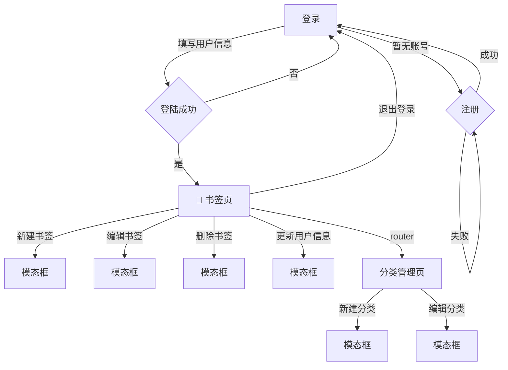

# Bookmarket 🔖

> 这是一款用于保存浏览器书签的精美网站

## 功能介绍

### 登录系统

1. 是否存在账户，不存在支持用户注册并登录
2. 已存在账户，支持使用 email 和 password 进行登录
3. 登陆后保存登录状态，当用户下次登录时可以直接进入（登录态保存可以使用 localStorage）

### 新建书签

1. 输入对应的网址
2. 自动拉取网站的 favicon 作为图标，支持自定义
3. 自动获取网站的 title 作为名称，支持自定义
4. 自动获取网站的 meta 中 description 信息作为描述，支持自定义
5. 创建时自动检查是否已存在，存在提示用户，不存在创建成功
6. 支持填写分类（预置五种分类：工具、资讯、娱乐、编程、AI）

### 书签列表

1. 支持卡片和列表模式切换
2. 支持分页查看
3. 支持全局关键字模糊匹配搜索
4. 支持根据分类搜索
5. 支持点击打开新的浏览器 Tab 页
6. 支持 hover 展示二维码供移动端扫码预览
7. 支持点击编辑按钮进入编辑页面
8. 支持点击删除按钮删除书签（删除前提问用户，是否确定删除）
9. 支持导出为 json 文件和 csv 文件 10.支持批量导入 json 文件和 csv 文件快速创建书签（包含去重能力）

### 编辑书签

1. 复用新建书签 UI
2. 新建按钮文案换成更新

### 分类管理

1. 支持新建分类
2. 支持删除分类（因为关联的有书签，需要解绑才能删，未解绑，提示用户解绑完成后删除，或强制删除，自动解绑全部）

## 数据模型

```typescript
// 用户
interface IUser {
  id: number;
  username: string;
  email: string;
  pwd: string; // decode passwrod
  create_time: number; // create time
  update_time: number; // update time
  avatar?: string;
}
// 书签
interface IBookmark {
  id: string; // uniqueKey
  url: string; // website link url
  icon: string; // favicon
  desc: string; // description
  tags: string[]; // tag ids
  create_time: number; // create time
  update_time: number; // update time
  user_id: number;
}
```

```typescript
interface ITag {
  id: string; // uniqueKey
  content: string; // tag content
  create_time: number; // create time
  update_time: number; // update time
  user_id: number;
}
```

## 数据库

数据库采用 supabase

```js
import { createClient } from '@supabase/supabase-js';

const supabaseUrl = 'https://kvxehtaaupklfnrvrcen.supabase.co';
const supabaseKey = process.env.SUPABASE_KEY;
const supabase = createClient(supabaseUrl, supabaseKey);
```

## 页面逻辑

1. 访问页面，首先校验是否已登录，如果已登录则直接进入列表页面
2. 如果未登录，则重定向到登录页面
3. 进入到列表页后，用户可以通过顶部栏的导航进入到分类管理页面，查看所有分类，并对分类做新增和删除等操作
4. 在列表页，用户可以使用搜索能力快速查找自己想要的书签，也可以切换布局查看（切换布局的时候页面存在过渡动画效果）
5. 用户可以在右上角的用户头像位置通过点击操作打开弹框，进行查看和修改用户信息



## 编码要求

- 组件化，将不同的模块拆分成组件实现，方便复用和维护
- hook 化，将复杂的业务逻辑抽取成对应的 hook 来实现复用
- 布局采用弹性布局

## 技术栈

- vue3
- typescript
- vue-router@4
- pinia
- tailwindcss

## 项目启动

### 1. 安装依赖

```bash
yarn install
```

### 2. 配置环境变量

创建 `.env` 文件并配置 Supabase 密钥：

```bash
VITE_SUPABASE_ANON_KEY=your_supabase_anon_key_here
```

### 3. 启动开发服务器

```bash
yarn dev
```

### 4. 构建生产版本

```bash
yarn build
```

## 项目结构

```
src/
├── components/          # 组件
│   ├── BookmarkCard.vue    # 书签卡片组件
│   ├── BookmarkList.vue    # 书签列表组件
│   ├── ConfirmModal.vue    # 确认模态框
│   └── ImportModal.vue     # 导入模态框
├── pages/              # 页面
│   ├── Login.vue          # 登录页面
│   ├── Register.vue       # 注册页面
│   ├── Bookmarks.vue      # 书签列表页面
│   ├── BookmarkForm.vue   # 书签表单页面
│   └── Categories.vue     # 分类管理页面
├── stores/             # 状态管理
│   ├── auth.ts            # 认证状态
│   ├── bookmarks.ts       # 书签状态
│   └── tags.ts            # 分类状态
├── types/              # 类型定义
│   └── index.ts           # 接口定义
├── utils/              # 工具函数
│   └── index.ts           # 通用工具
├── lib/                # 第三方库配置
│   └── supabase.ts        # Supabase 客户端
├── router/             # 路由配置
│   └── index.ts           # 路由定义
├── App.vue             # 主应用组件
└── main.ts             # 应用入口
```

## 功能特性

- ✅ 用户注册登录系统
- ✅ 书签的增删改查
- ✅ 自动获取网站信息
- ✅ 分类管理
- ✅ 搜索和过滤
- ✅ 卡片/列表视图切换
- ✅ 分页显示
- ✅ 二维码生成
- ✅ 导入导出功能
- ✅ 响应式设计
- ✅ 路由守卫
- ✅ 状态管理
- ✅ TypeScript 支持
